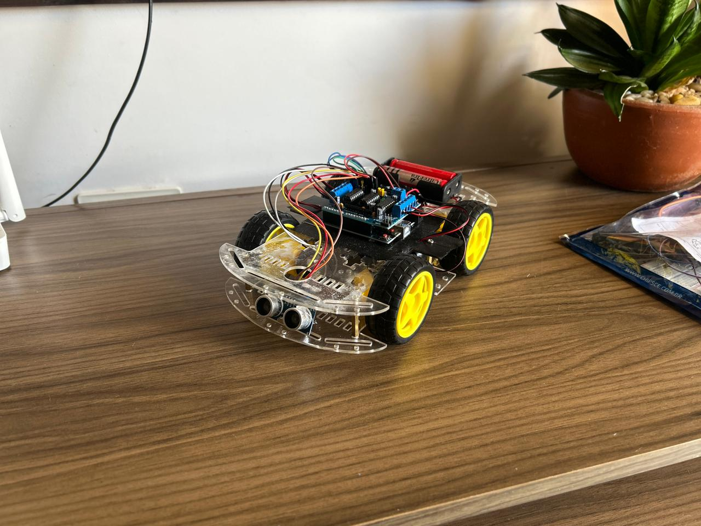

# 🤖 Robô Sumô Autônomo com Arduino

Projeto de um robô sumô autônomo desenvolvido utilizando Arduino, Motor Shield L293D, sensor ultrassônico HC-SR04 e sensores de linha para detecção de borda.

---

## 📸 Demonstração

---

## 🎯 Objetivo

Construir um robô capaz de:

- Detectar o oponente usando sensor ultrassônico
- Atacar automaticamente quando o oponente estiver próximo
- Detectar a borda da arena com sensores de linha
- Recuar automaticamente para evitar sair da arena
- Operar utilizando máquina de estados

---

## 🧠 Arquitetura do Sistema

O robô utiliza uma **máquina de estados finita**, com os seguintes estados:

- PROCURANDO
- ATACANDO
- RECUANDO
- AVANCANDO
- PARADO

A lógica prioriza:

1. Sensores de linha (segurança da arena)
2. Detecção do oponente
3. Modo de busca

---

## 🔧 Hardware Utilizado

- Arduino Uno
- Adafruit Motor Shield (L293D)
- Sensor Ultrassônico HC-SR04
- 2 Sensores de Linha (frontal e traseiro)
- 4 Motores DC

---

## ⚙️ Tecnologias

- C++ (Arduino)
- Controle de motores DC
- Debounce de sensores
- Máquina de estados
- Programação embarcada

---

## 🚀 Funcionalidades Técnicas

- Controle individual de 4 motores
- Sistema de debounce para evitar ruído nos sensores
- Prioridade absoluta para detecção de borda
- Controle de velocidade dinâmico
- Alternância automática de direção durante busca

---

## 📂 Estrutura do Projeto
